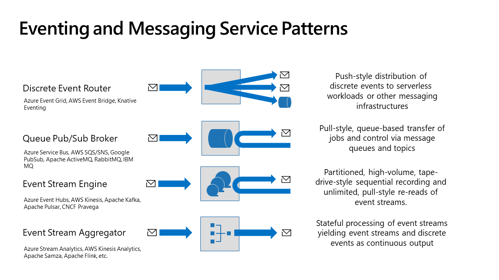

# Asynchronous Messaging and Eventing Resources

[Why would I care?](#why-would-i-care) | [Definitions: Messaging or eventing infrastructure](#definitions-messaging-or-eventing-infrastructure) | [Resources: Introductions and Patterns](#introductions-and-patterns) | [Resources: Open Standards](#open-standards) | [Resources: Products & Cloud Services](#products--cloud-services)

Once you've read through this intro, you will find that this document contains a
(growing) list of resources that cover whether and how to use asynchronous
messaging/queueing and eventing infrastructures with your applications
effectively and which you can use for self-study purposes.

I am the product architect of the messaging and eventing services in the
Microsoft Azure cloud and have helped building these capabilities for over 15
years now, starting well before the name "Azure" even existed. 

Our team owns multiple hyperscale broker platforms (Azure Service Bus, Event
Hubs, Event Grid, and Relay) that are deployed in hundreds of large clusters in
over 70 Azure regions all around the world and handle many (!) trillion (!)
requests each day (!). We also invented, prototyped, and productized several
other Azure capabilities (Azure IoT Hub, Azure Notification Hubs, Tenant
Resource Provisioning) that are now owned by different teams at Microsoft.

In addition to the product work, I am deeply engaged in open interoperability
standards and represent Microsoft on the OASIS AMQP Technical Committee (as
co-chair), the OASIS MQTT Technical Committee, the CNCF Open Telemetry Working
Group, the CNCF CloudEvents and CNCF xRegistry projects, and the CNCF Serverless
Working Group. In the past, I've also been a member of the OPC Foundations
Technical Advisory Council and the OPC UA Working Group where I've worked on the
PubSub specification in particular. Relevant technical documents are also linked
below.

## "Why would I care?"

In addition to pointing to resources, allow me to also set some context with a
few definitions (some of which may be surprising) of key concepts of messaging
and eventing. I will keep these brief since the concepts are covered more
broadly in many of the resources I point to.

Generally, if you are building software that requires more than one computer to
do its job, you should know about asynchronous messaging concepts.

"Asynchronous" means here: Your application sends a message or event and then
carries on doing something else. It does not sit around waiting for an
outcome.

For many developers, that is the first giant mental hurdle, since we've all been
raised on "imperative" programming models. You make a function call and cause some
work to happen and only once that work has been reported as done (or failed)
your own code continues with its work.

Yet, we all use asynchronous messaging every day in the physical world. If we
want to send a gift to someone in a different city, we will go to the post
office and entrust the postal service with the package. The postal service takes
care of getting it to the destination and also tracks and reports whether the
package has been delivered successfully. Once the package has been delivered,
your friend might then call you and excitedly thank you for the gift you sent.
If you ask for it you will get feedback, but maybe on a different channel and
after however long the handling and delivery took and usually with a clear
reference to the package you sent.

That is what asynchronous messaging infrastructure does, but for your apps.

* Decoupling: A system handling work behind a messaging infrastructure can be
  running at capacity and yet not be overwhelmed and can even be down while the
  messaging infrastructure still accepts messages on its behalf.
* Delivery: You can entrust over your messages and the messaging system will try
  its best not lose them. It will then attempt to deliver them to the right
  parties and will retry as often as necessary.
* Buffering: A messaging infrastructure is generally great at accepting bursts
  of messages at once and organizing them for later retrieval. The retrieval can
  then occur at the pace that your application can handle. That is also called
  load-leveling.
* Network-Bridging: Messaging infrastructures can often be attached to multiple
  networks, allowing information to pass between applications in those networks
  without there being IP-level connectivity between them.

## Definitions: Messaging or eventing infrastructure

"Message broker", "queue", "service bus", "event router", "event stream engine",
"event aggregator", are all names for asynchronous messaging and eventing
infrastructure elements and the list is by no means exhaustive. I will give you
a brief definitions for all the words in those names for orientation.

* **Producer** - A producer (or _sender_ or _publisher_) is a role in a software
  system that wants to share/distribute information and therefore produces
  messages and makes them available via a messaging infrastructure.
* **Consumer**  - A consumer (or _receiver_ or _subscriber_) is a role in a
  software system that retrieves/gets messages from an messaging infrastructure
  and consumes them. Consuming often, but not always, means to act on the
  information.
* **Content** - Content (or _payload_ or _body_) is the information the producer
  wants the consumer(s) to receive and handle. Content may be any kind of data
  in any format.
* **Message** - A message is an envelope that wraps the content for transfer. It
  contains metadata annotations that helps the messaging infrastructure and
  frameworks understand how to route and handle the information, just like the
  addressing information and "express" stickers on a postal package or letter
  envelope.
* **Event** - An event is a variation of a message whose content reflects a
  fact. A fact is a historical statement of some past activity: "the milk carton
  dropped on the floor" is a fact that will forever be true when looking back at
  the morning of this day if it happened to you. The great thing about facts is
  that they can be easily distributed and cached and copied and transformed
  because the exact information they carry will forever be true and never again
  change. "Discrete" events are independent of other events (unlike those in a
  _stream_, see below) and are usually immediately actionable. (These
  philosophical considerations matter a lot for arriving at smart
  architectures).
* **Job** - A job is a variation of a message whose content reflects an intent.
  The producer sends content with the intent of a consumer doing some work based
  on that content. "I just took this purchase order from a customer, please
  package and deliver these goods". Getting the job done might again involve
  multiple parties that handle parts if it, each being instructed through jobs.
* **Queue** - A queue is a messaging infrastructure entity that assigns the
  exclusive ownership and temporary control over the lifecycle of a message to
  one of potentially many competing consumers. The consumer can decide to
  finally accept the message which removes it from the queue and thus prevents
  the work from being performed again or to make it again available for
  consumption if an error prevented the work from being completed such that a
  retry is possible. The message can also be rejected and sidelined if it cannot
  be processed even with a retry. Message queues may also provide ordering
  assurances which are defining for the "queue" data structure in computer
  science, but that is optional.
* **Router** - A router ( or _topic_) is a messaging infrastructure entity that
  accepts messages from producers and dispatches them onwards to other messaging
  infrastructure entities or to consumers, often considering rules that inspect
  the message metadata annotations. Routers may often be configured dynamically
  and at runtime to deliver messages to interested parties, which are then
  called subscribers. 
* **Stream** - An event stream (or _event series_) is a sequence of related
  events, which typically stem from the same producer or at least the same
  producer context (i.e. multiple producers create events about the same thing).
  An event stream engine may multiplex delivery of many concurrent event streams
  (occasionally also called _topic_) and may split those up across several
  physical logs (partitions) while keeping any one event stream together on a
  partition to ensure preserving order.
* **Checkpoint** - Event streams are usually processed by taking several events
  at a time. Since events are not jobs and therefore do not require exclusive
  handling, event stream engines therefore shift the burden of keeping track of
  what events have and have not been consumed to the consumer themselves.
  Consumer will periodically note a checkpoint relative to the stream and/or
  partition and resume from that noted checkpoint when needed. Some event stream
  brokers have internal facilities that help with noting those checkpoints.
* **Broker** - Broker (or _service bus_) is the term for a server or
  infrastructure that brokers messages and does so via queues or routers or
  streams. Brokers generally only act on metadata of messages and do not consider
  the content of the message.
* **Aggregator** - An aggregator or **stream processor** or **stream analytics** 
  engine is a compute service that takes one more more event streams as input 
  and yields one or more event streams or derived discrete events as output. The
  output(s) might be a filtered view of the input stream or consist of computed 
  aggregates of input eventsor it might be a join of multiple streams or streams
  with reference data. Contrary to brokers, aggregators will consider the content
  of events.
* **Schema** - A formal description of the structure of the content of a message
  or event. Schemas are used to validate the content of messages and events and
  to help with the interpretation of the content. Schemas are often versioned and
  evolve over time. Schemas are often shared between producers and consumers to
  ensure that the content is understood correctly.

  
## Presentation Folder

You can find all my published presentations as PowerPoint files and PDFs in [this folder](./presentations/). Content is generally [CC-BY 4.0](https://creativecommons.org/licenses/by/4.0/). 

## Introductions and Patterns

* [Talk: Integrate 2024 London: The evolution of Azure Messaging](https://www.youtube.com/watch?v=KWZGIPzgRU0) An overview of Azure Messaging brokers and the latest updates.
* [Talk: "What is a message queue and why would I use one?", We Are Developers Berlin (2022)](https://www.youtube.com/watch?v=bHSV916YbHE)   Introduction to queues in general and message queues in particular and where and why they are used. 
* [Talk: "Messaging Patterns for Developers"
  (2021)](https://www.youtube.com/watch?v=ef1DK76rseM).  This is a .NET talk, but
  conceptually also applicable to all other programming languages.
* [Talk: "Eventing, Serverless, and the Extensible Enterprise", Voxxed Athens
  2018](https://www.youtube.com/watch?v=qCNXUUlhJJE).  In this talk I discuss
  (Micro-)services and serverless functions in context with messaging and
  eventing.
* [Talk: "Events, data Points, and Messages", Thingmonk
  2017](https://www.youtube.com/watch?v=ITrlLErsqzY&feature=emb_imp_woyt).  This
  is a short talk from where I drew the lines between events and messages.
* [Events, Data Points, and Messages - Choosing the right Azure messaging
  service for your
  data](https://azure.microsoft.com/en-us/blog/events-data-points-and-messages-choosing-the-right-azure-messaging-service-for-your-data/).  A blog article explaining the differences between the services we offer.
* [Asynchronous messaging
  options](https://docs.microsoft.com/en-us/azure/architecture/guide/technology-choices/messaging). Azure architecture center article that lays out those options in more detail.
* [Samples: Streaming at scale in
  Azure](https://docs.microsoft.com/en-us/samples/azure-samples/streaming-at-scale/streaming-at-scale/),
  [(repo)](https://github.com/Azure-Samples/streaming-at-scale) A repository
  with many examples of composite usage of Azure services for event streaming.

## Open Standards

This section lists several open standards efforts that are important to the
messaging space. The focus of this section is on open and
product/project-neutral data formats and protocol standards, not on
project-proprietary wire formats even if the projects are open source. 

* [Talk: "Azure Messaging: Standards Matter", Azure & AI Conference
  2022](https://youtu.be/FVOhLqE9fzw) Discussion of patterns and the
  standards enumerated below. [(Slides)](presentations/2022-04-05%20Azure%20Messaging%20%E2%80%93%20Standards%20Matter.pdf)

### CNCF CloudEvents

CloudEvents is a common information model for events. It defines what an event
is and what a set of common attributes are that make the event useful in many
contexts. CloudEvents then defines formats (JSON, Avro, AMQP, Protbuf, XML) in
which a CloudEvent can be expressed and protocol bindings for how CloudEvents
can be transported (HTTP, AMQP, MQTT, Kafka).  

* [CloudEvents Primer](https://github.com/cloudevents/spec/blob/v1.0.2/cloudevents/primer.md) - An introduction to CloudEvents with architectural considerations.
* [CloudEvents - Version 1.0.2](https://github.com/cloudevents/spec/blob/v1.0.2/cloudevents/spec.md). This is the main specification.
  * [HTTP Protocol Binding for CloudEvents - Version 1.0.2](https://github.com/cloudevents/spec/blob/v1.0.2/cloudevents/bindings/http-protocol-binding.md)
  * [HTTP 1.1 Web Hooks for Event Delivery - Version 1.0.2](https://github.com/cloudevents/spec/blob/v1.0.2/cloudevents/http-webhook.md)
  * [AMQP Protocol Binding for CloudEvents - Version 1.0.2](https://github.com/cloudevents/spec/blob/v1.0.2/cloudevents/bindings/amqp-protocol-binding.md)
  * [Kafka Protocol Binding for CloudEvents - Version 1.0.2](https://github.com/cloudevents/spec/blob/v1.0.2/cloudevents/bindings/kafka-protocol-binding.md)
  * [MQTT Protocol Binding for CloudEvents - Version 1.0.2](https://github.com/cloudevents/spec/blob/v1.0.2/cloudevents/bindings/mqtt-protocol-binding.md)
  * [NATS Protocol Binding for CloudEvents - Version 1.0.2](https://github.com/cloudevents/spec/blob/v1.0.2/cloudevents/bindings/nats-protocol-binding.md)
  * [WebSockets Protocol Binding for CloudEvents - Version 1.0.2](https://github.com/cloudevents/spec/blob/v1.0.2/cloudevents/bindings/websockets-protocol-binding.md)
  * [Avro Event Format for CloudEvents - Version 1.0.2](https://github.com/cloudevents/spec/blob/v1.0.2/cloudevents/formats/avro-format.md)
  * [JSON Event Format for CloudEvents - Version 1.0.2](https://github.com/cloudevents/spec/blob/v1.0.2/cloudevents/formats/json-format.md)
  * [Protobuf Event Format for CloudEvents - Version 1.0.2](https://github.com/cloudevents/spec/blob/v1.0.2/cloudevents/formats/protobuf-format.md)
* [CloudEvents 1.0.2 repo](https://github.com/cloudevents/spec/blob/v1.0.2/cloudevents/) where you
  can find all the protocol bindings and format specs
* [CloudEvents working branch](https://github.com/cloudevents/spec/tree/main) where we do the current work, especially on schema and message catalogs and discovery.
   * [CNCF Schema Registry API Version 0.2-wip](https://github.com/cloudevents/spec/blob/main/schemaregistry/spec.md)
   * [CNCF CloudEvents – Subscriptions API - Version 0.1-wip](https://github.com/cloudevents/spec/blob/main/subscriptions/spec.md)
   * [Discovery and Subscription Primer - WIP](https://github.com/cloudevents/spec/blob/main/discovery/primer.md)
   * [CloudSubscriptions: Discovery - Version 0.1-wip](https://github.com/cloudevents/spec/blob/main/discovery/spec.md)
   * [CNCF Message and Event Catalog API (not yet merged)](https://github.com/clemensv/spec/blob/messagecatalog/messagecatalog/spec.md)
* [Talk: "CloudEvents Intro and Demos"](https://www.youtube.com/watch?v=yg7RuDWHwV8)
* [Talk: "CloudEvents 1.0 and Beyond"](https://www.youtube.com/watch?v=YpUQbxx3jkk)
* [Talk: "CloudEvents DeepDive", KubeCon Europe 2019](https://www.youtube.com/watch?v=-3gOqR_TGEs)

### CNCF xRegistry

xRegistry is a project spawned from the CloudEvents project that aims to provide a common API and document format for schema and message
catalogs and discovery services. It is a companion to CloudEvents and aims to
provide a common way to find and use schemas and messages in a CloudEvents
context, but also for general messaging infrastructures. xRegistry is extensible
to support other metadata models.

* [xRegistry "manifest" document examples](https://github.com/clemensv/xregistry-cli/tree/main/samples/message-definitions)
* [CNCF xRegistry Site](https://xregistry.io/)
  * [CNCF xRegistry Repo](https://github.com/xregistry/spec/)
    * [xRegistry Primer](https://github.com/xregistry/spec/blob/main/core/primer.md)
    * [xRegistry Core Spec](https://github.com/xregistry/spec/blob/main/core/spec.md)
    * [xRegistry Schema Spec](https://github.com/xregistry/spec/blob/main/schema/spec.md)
    * [xRegistry Message Spec](https://github.com/xregistry/spec/blob/main/message/spec.md)
    * [xRegistry Endpoint Spec](https://github.com/xregistry/spec/blob/main/endpoint/spec.md)
    * [xRegistry CloudEvents registry (Schema + Message + Endpoint)](https://github.com/xregistry/spec/blob/main/cloudevents/spec.md)
* Prototypical Tools:
  * [xRegistry CLI](https://github.com/clemensv/xregistry-cli) The xRegistry CLI is a command-line tool that allows you to 
    interact with xRegistry servers and lets you modify xRegistry manifest documents. More importantly, it's a code generator
    that can create strongly-typed producer and consumer code for Apache Kafka, Azure Event Hubs, and Fabric Eventstreams (and
    other services) from xRegistry schema and message documents and endpoints.
  * [xRegistry Server](https://github.com/duglin/xreg-github) The xRegistry Server is a Go implementation of the xRegistry
    API. It is a reference implementation maintained by the chair of the WG that can be used as a starting point for your own xRegistry server.
  * [Avrotize](https://github.com/clemensv/avrotize) Avrotize is a "Rosetta Stone" for data structure definitions, allowing you to convert 
    between numerous data and database schema formats and to generate code for different programming languages. It is, for instance, a well-documented 
    and predictable converter and code generator for data structures originally defined in JSON Schema (of arbitrary complexity). 
    The tool leans on the Apache Avro-derived Avrotize Schema as its integration schema model.
  * [Avrotize Visual Studio Code Extension](https://marketplace.visualstudio.com/items?itemName=clemensvasters.avrotize) An extension 
    for Visual Studio Code that allows you to interact with Avrotize from the file explorer.

### OASIS AMQP 

AMQP ("Advanced Message Queue Protocol") is the global standard enterprise
messaging protocol. Initiated by JPMorgan, it's the standard protocol in many
areas of the financial industry, trade, and industrial applications. It has been
developed in OASIS and standardized by ISO as 19464:2014.

AMQP is implemented by a most major queue-oriented message brokers.

* [AMQP 1.0](https://docs.oasis-open.org/amqp/core/v1.0/os/amqp-core-overview-v1.0-os.html) core standard document. Also ISO 19464:2014.
  * [AMQP Addressing Version 1.0](https://docs.oasis-open.org/amqp/addressing/v1.0/csd01/addressing-v1.0-csd01.html)
  * [AMQP Filter Expressions Version 1.0](https://docs.oasis-open.org/amqp/filtex/v1.0/csd01/filtex-v1.0-csd01.html)
  * [AMQP Link Pairing Version 1.0](https://docs.oasis-open.org/amqp/linkpair/v1.0/cs01/linkpair-v1.0-cs01.html)
  * [AMQP Request-Response Messaging with Link Pairing Version 1.0](https://docs.oasis-open.org/amqp/linkpair/v1.0/cs01/linkpair-v1.0-cs01.html) 
  * [AMQP Claims-based Security Version 1.0](https://docs.oasis-open.org/amqp/amqp-cbs/v1.0/csd01/amqp-cbs-v1.0-csd01.html)
  * [Event Stream Extensions for AMQP Version 1.0](https://docs.oasis-open.org/amqp/event-streams/v1.0/csd01/event-streams-v1.0-csd01.html)
* [Xin Chen's Awesome AMQP resource list](https://github.com/xinchen10/awesome-amqp/blob/master/README.md) which includes links to AMQP stacks and docs.
* [My 6-Part video series](https://www.youtube.com/watch?v=ODpeIdUdClc&list=PLmE4bZU0qx-wAP02i0I7PJWvDWoCytEjD) explaining AMQP

### OASIS MQTT 

MQTT (formerly "MQ Telemetry Transport") is a lightweight pubsub protocol that
was initially developed by IBM as a companion protocol to their MQ product. IBM
then submitted it for standardization to OASIS, where the input specification
was turned into version 3.1.1. and the TC then developed version 5.0 from there,
with significant input from Microsoft.

* [MQTT 3.1.1](https://docs.oasis-open.org/mqtt/mqtt/v3.1.1/mqtt-v3.1.1.html)
* [MQTT 5.0](https://docs.oasis-open.org/mqtt/mqtt/v5.0/mqtt-v5.0.html)
* [MQTT Project Site](https://mqtt.org/) including a resource directory

### Apache Avro

Avro is a data serialization system that provides rich data structures and a
compact, fast, binary data format. At Microsoft, we like Avro's Schema format 
even more than we like its binary encoding. Unfortunately and fortunately, the
Avro project is a bit of a "sleeping beauty" and has not seen much evolution in
the last few years. We think it could need a bit of a jolt and to that effect,
we have a few pending proposals that we hope to get into the project soon.

* [Official Avro Specification](https://avro.apache.org/docs/1.12.0/specification/)
* [Formal Avro Schema spec (proposed)](https://github.com/clemensv/avrotize/blob/master/specs/avro-schema.md) 
  This is a proposed formal specification of the Avro Schema format in RFC-style
  that is currently only informally described in the Avro documentation. The
  proposal aims to make the Avro Schema format more predictable and easier to
  implement and to use in code generators and other tools.
* [Avrotize Schema spec (proposed)](https://github.com/clemensv/avrotize/blob/master/specs/avrotize-schema.md) 
  This is a proposed formal specification of the Avrotize Schema format that is
  derived from the Avro Schema format and adds a few additional features that
  make it more suitable for use in code generators and other tools. The Avrotize
  Schema format is a superset of the Avro Schema format.
* [Avro Schema JSON Schema (proposed)](https://github.com/clemensv/avrotize/blob/master/specs/avro-schema-schema.json) 
  This is a proposed JSON Schema for the Avro Schema format that can be used to
  validate Avro Schema documents.
* ["Plain JSON" encoding for Apache Avro](https://github.com/clemensv/avrotize/blob/master/avrojson.md) 
  The Apache Avro project defines a JSON Encoding, which is optimized for
  encoding data in JSON, but primarily aimed at exchanging data between
  implementations of the Apache Avro specification. The choices made for this
  encoding severely limit the interoperability with other JSON serialization
  frameworks. This document defines an alternate, additional mode for Avro JSON
  Encoders, preliminarily named "Plain JSON", that specifically addresses
  identified interoperability blockers. 
  * [JIRA-3986](https://issues.apache.org/jira/browse/AVRO-3986)
  * Illustrating [Avro project PR for C#](https://github.com/apache/avro/pull/2888)

## Related Projects

* [Real-Time Sources](https://github.com/clemensv/real-time-sources/) 
  Learning how to build event streaming solutions with Microsoft Azure Event
  Hubs, Microsoft Fabric Event Streams, and any Apache Kafka compatible server
  and service is more interesting when you have real time data sources to work
  with. This repo contains command line tools, written in Python, that can be
  used to retrieve real-time streaming data and related reference data from
  various APIs, and then routing the data to Apache Kafka compatible endpoints.
  For each tool, there is a corresponding, pre-built (Docker-) container image
  that you can pull and use instantly from this repo's container registry.
  * [GTFS Realtime - Public transport data](https://github.com/clemensv/real-time-sources/blob/main/gtfs/CONTAINER.md)
  * [NOAA Tides ands Currents - Water level and current data](https://github.com/clemensv/real-time-sources/blob/main/noaa/CONTAINER.md)
  * [RSS Feeds - News and blog posts](https://github.com/clemensv/real-time-sources/blob/main/rss/CONTAINER.md)
  * [Pegelonline - Water level and current data](https://github.com/clemensv/real-time-sources/blob/main/pegelonline/CONTAINER.md)
  * [USGS Instantaneous Values - Water quality and quantity data](https://github.com/clemensv/real-time-sources/blob/main/usgs-iv/CONTAINER.md)
* [Forza Telemetry Bridge](https://github.com/clemensv/forza-telemetry-bridge) 
  ForzaBridge is a console application designed to capture and forward Forza
  Motorsport telemetry data to Microsoft Azure Event Hubs or Microsoft Fabric
  Event Streams. It utilizes UDP to listen for telemetry data sent from Forza
  Motorsport games and forwards this data after processing and formatting into
  cloud event streams. The bridge is immediately derived from a project that
  implements a production telemetry pipeline for race cars competing in the WEC
  and IMSA endurance championships.

## Books

An incomplete list of books about product-/project-neutral messaging and
eventing principles and patterns. I am an impatient book reader and prefer going
straight to authoritative documents, therefore I am happy to take PRs for this
section from readers who've been helped by particular books.

* [Enterprise Patterns by Gregor Hohpe, 2003](https://www.enterpriseintegrationpatterns.com/gregor.html) - Timeless classic. Truth.
* [Flow Architectures by James Urquhart, 2021](https://www.goodreads.com/book/show/51771839-flow-architectures) -
  This is a very current, conceptual overview of various aspects of eventing; don't expect a
  "how-to" book, but one that introduces the notion of application architectures
  enabled by data in motion.

## Products & Cloud Services

### Microsoft Azure

This is a list of the Azure Messaging services.

* [Azure Messaging Overview](https://azure.microsoft.com/en-us/solutions/messaging-services/)
* [Azure Service Bus](https://azure.microsoft.com/en-us/services/service-bus) -
  fast, transactional queue and pubsub message broker with full JMS 2.0 support.
   * [Talk: Azure Service Bus Deep Dive, Azure & AI Conference 2022](https://youtu.be/LM7DByKOHBs) [(Slides)](presentations/2022-04-06%20Service%20Bus%20Deep%20Dive.pdf)
   * [Azure Service Bus bindings for Azure Functions](https://docs.microsoft.com/en-us/azure/azure-functions/functions-bindings-service-bus)
   * [Azure Service Bus JMS 2.0 developer guide](https://docs.microsoft.com/en-us/azure/service-bus-messaging/jms-developer-guide?tabs=JMS-20)
   * [Federation](https://docs.microsoft.com/en-us/azure/service-bus-messaging/service-bus-federation-overview)
* [Azure Event Hubs](https://azure.microsoft.com/en-us/services/event-hubs/) -
  fast event stream engine with AMQP, HTTP, and Apache Kafka protocol support.
   * [Talk: Azure Event Hubs Deep Dive, Azure & AI Conference 2022](https://youtu.be/358TuU88Nvg) [(Slides)](presentations/2022-04-07%20Event%20Hubs%20Deep%20Dive.pdf)
   * [Use Azure Event Hubs from Apache Kafka applications](https://docs.microsoft.com/en-us/azure/event-hubs/event-hubs-for-kafka-ecosystem-overview)
   * [Azure Schema Registry in Azure Event Hubs](https://docs.microsoft.com/en-us/azure/event-hubs/schema-registry-overview)
   * [How to create a Spring Cloud Stream Binder application with Azure Event Hubs](https://docs.microsoft.com/en-us/azure/developer/java/spring-framework/configure-spring-cloud-stream-binder-java-app-azure-event-hub)
   * [Transfers, locks, and settlement](https://docs.microsoft.com/en-us/azure/service-bus-messaging/message-transfers-locks-settlement) 
   * [Sessions](https://docs.microsoft.com/en-us/azure/service-bus-messaging/message-sessions)
   * [Federation](https://docs.microsoft.com/en-us/azure/event-hubs/event-hubs-federation-overview)  
* [Azure Event Grid](https://azure.microsoft.com/en-us/services/event-grid/) - publish/subscribe event router with support for CNCF CloudEvents, foundation for all events raised by Azure platform services.
  * [Tutorial: Automate resizing uploaded images using Event Grid](https://docs.microsoft.com/en-us/azure/event-grid/resize-images-on-storage-blob-upload-event?tabs=dotnet%2Cazure-powershell)
  * [Tutorial: Send email notifications about Azure IoT Hub events using Event Grid and Logic Apps](https://docs.microsoft.com/en-us/azure/event-grid/publish-iot-hub-events-to-logic-apps)
  * [Tutorial: Route custom events to Azure Relay Hybrid Connections with Azure CLI and Event Grid](https://docs.microsoft.com/en-us/azure/event-grid/custom-event-to-hybrid-connection)
* [Azure Relay and Hybrid Connections](https://docs.microsoft.com/en-us/azure/azure-relay/relay-what-is-it) - WebSocket bridges for reaching application endpoints behind NATs and Firewalls, supporting HTTP requests and bi-directional binary streams.
  * [What is Relay?](https://docs.microsoft.com/en-us/azure/azure-relay/relay-what-is-it)
  * [Azure Relay Hybrid Connections protocol](https://docs.microsoft.com/en-us/azure/azure-relay/relay-hybrid-connections-protocol)
* [Azure IoT Hub](https://azure.microsoft.com/en-us/services/iot-hub/) - specialized broker focused on attaching "Internet of Things" devices and edge gateways to the cloud. 
* [Azure WebPubSub](https://azure.microsoft.com/en-us/services/web-pubsub/) - Real-time publish-subscribe messaging for web application client development based on WebSockets
* [Azure SignalR](https://azure.microsoft.com/en-us/services/signalr-service/) - Real-time publish-subscribe messaging with a .NET focused programming experience for web application client development based on WebSockets
* [Azure Notification Hubs](https://azure.microsoft.com/en-us/services/notification-hubs/) - High-scale broadcast and multicast push notification distribution for all popular mobile platforms.  

### AWS

AWS has a fleet of messaging services which reflects very similar architectural
considerations as the Azure services.

* [Amazon SQS](https://aws.amazon.com/en/sqs/) corresponds to Azure Storage
  Queues and Service Bus Queues (FIFO)
* [Amazon MQ](https://aws.amazon.com/en/amazon-mq) corresponds to Azure Service
  Bus, albeit at far smaller scale and less managed
* [Amazon Kinesis](https://aws.amazon.com/en/kinesis/) corresponds to Azure
  Event Hubs
* [Amazon EventBridge](https://aws.amazon.com/de/eventbridge/) corresponds to
  Azure Event Grid
* [Amazon IoT Core](https://aws.amazon.com/en/iot-core/) corresponds to Azure
  IoT Hub.
  
### Apache 

The Apache Software Foundation hosts several popular open source projects that
produce message and event broker infrastructures.

* [ActiveMQ](https://activemq.apache.org/) - transactional queue and pubsub broker family (ActiveMQ "Classic" and Artemis)
* [Qpid](https://qpid.apache.org/) - transactional queue and pubsub broker family, also including an AMQP router
* [Pulsar](https://pulsar.apache.org/) - event stream engine and queue broker
* [Kafka](https://kafka.apache.org/) - event stream engine
* [Camel](https://camel.apache.org/) - integration framework with hundreds of components and several patterns 

### CNCF

The Cloud Native Computing Foundation also hosts a few messaging and eventing
centric projects.

* [NATS](https://www.cncf.io/projects/nats/) - fast, simple pubsub message broker 
* [Pravega](https://cncf.pravega.io/) - stream-oriented replicated storage 
* [Strimzi](https://www.cncf.io/projects/strimzi/) - Kubernetes operator for Apache Kafka, 
  curiously in CNCF and not in the ASF and the Apache Kafka project, which says something 
  about the latter.

### Eclipse

The Eclipse Foundation has a strong IoT focus and hosts various MQTT-related
projects. It is also hosting the Jakarta Messaging project that carries forward
the popular JMS standard.

* [Mosquitto](https://mosquitto.org/) - reference MQTT broker implementation 
* [Paho](https://www.eclipse.org/paho/) - MQTT librarry collection for several programming languages
* [Jakarta Messaging (JMS)](https://projects.eclipse.org/projects/ee4j.messaging) - the one-and-sadly-only universal 
  Java API for message brokers, with an sadly-ultra-opinionated topology concept. Needs a thorough overhaul, 
  but is here and very useful.
